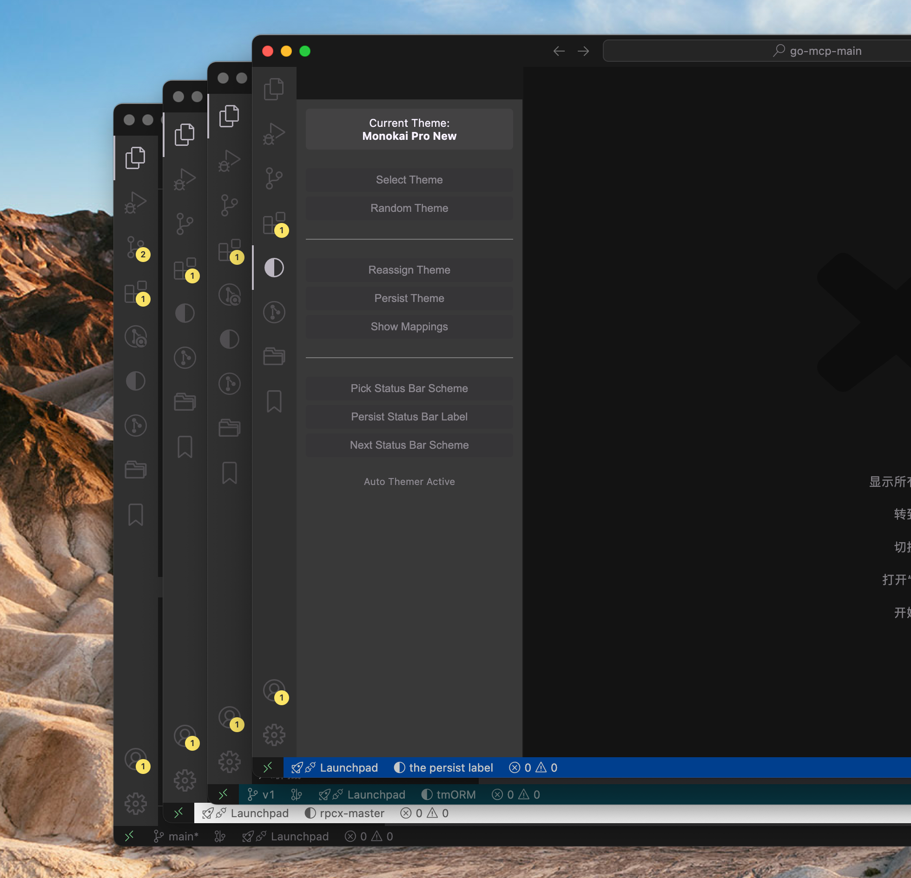

# auto-themer

自动为不同 VSCode 窗口-工作区分配与应用配色主题，并支持按工作区路径持久化主题映射。

- 通过Theme区分窗口:(autoThemer.conflictResolution=theme)

  

- 通过底部状态栏颜色与标签区分窗口:(autoThemer.conflictResolution=statusBar)

  

## 功能

- 通过主题或者底部状态栏区分工作区：多窗口场景会自动为每个窗口分配不同主题或者不同的底部状态栏颜色+标签，提升窗口的区分度。
- 工作区持久化映射：通过设置项文本 `autoThemer.themeMappingsText` 定义“工作区路径 → 主题”映射，也可以配置 `autoThemer.statusBarMappingsText`配置底部状态栏的标签映射。
- 简洁侧边栏：支持快速选择主题、持久化当前主题、查看并编辑映射、切换底部状态栏、持久化底部状态栏标签。

## 使用方式

- 进入插件设置，配置`autoThemer.windowsThreshold`，打开的窗口数超过该阈值时才会自动分配主题。
- 配置 `autoThemer.conflictResolution` ,选择`theme`或`statusBar`，分别表示通过主题或底部状态栏区分窗口。
- 其他操作可以通过侧边栏的插件面板设置，如切换主题、切换状态栏颜色、持久化当前工作区的主题映射、持久化底部状态栏标签映射。
- 新窗口打开工作区后，自动检测并分配主题或者状态栏到`.vscode/settings.json`；切换工作区或者关闭窗口时，会自动重置.vscode/settings.json的colorTheme。

### 插件面板功能说明
- select theme: 选择当前窗口的主题
- random theme: 随机为当前窗口分配主题
- reassign theme: 重新分配当前窗口的主题
- persist theme: 持久化当前窗口的主题映射
- show mappings: 查看工作区与主题的映射关系
- pick status bar scheme: 选择当前窗口的底部状态栏颜色配置(仅内置)
- persist status bar: 持久化当前窗口的底部状态栏标签映射

## 执行原理与链路

- 多窗口主题检查原理：
  所有VSCode窗口使用同一全局存储位置文件进行实例协调，位置: context.globalStorageUri.fsPath下的instances目录。(mac: ~/Library/Application Support/Code/User/globalStorage)
- 多窗口主题设置原理：
  基于打开的工作区中.vscode中的setting.json，关闭窗口或者关闭工作区则重置setting.json的colorTheme。

链路：
1. 启动后延迟初始化，扫描与记录活动窗口实例
2. 检查是否打开工作区，若存在持久化映射则直接应用映射主题（优先级最高）
3. 若无映射且为多窗口场景，执行唯一主题分配
4. 定期检查主题冲突并通过侧边栏与通知提示用户
5. 关闭窗口或移除工作区时，重置工作区 `.vscode/settings.json` 的 `workbench.colorTheme`，保证临时设置不残留


## 配置

在 VSCode 设置中配置：

```json
{
  "autoThemer.enabled": true,
  "autoThemer.conflictResolution": "theme",
  "autoThemer.windowsThreshold": 2,
  "autoThemer.builtinThemes": [],
  "autoThemer.themeMappingsText": "/my/pro-dev: Kimbie Dark; /easy/hc: Kimbie Dark",
  "autoThemer.statusBarMappingsText": "/my/pro-dev: 自定义标签; /easy/hc: 自定义项目"
}
```

说明：
`themeMappingsText` 使用分号分隔的 `路径: 主题` 文本，插件在内存中解析并使用该映射。
`statusBarMappingsText` 使用分号分隔的 `路径: 标签` 文本，插件在内存中解析并使用该映射。

## 开发

1. `npm install`
2. `npm run compile`
3. 在 VSCode 中按 F5 启动扩展开发主机

## 许可证

MIT License
