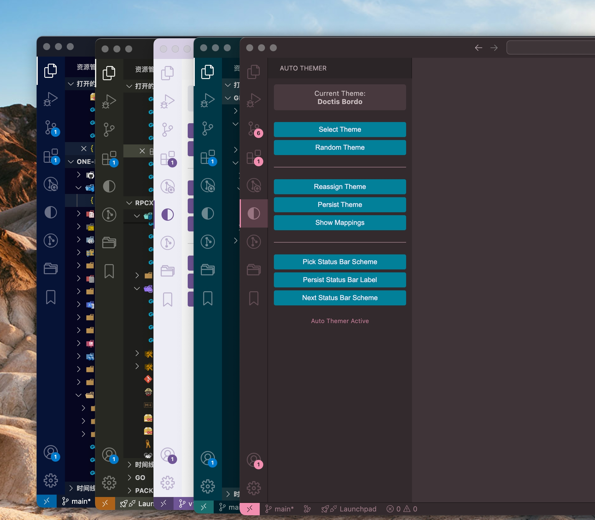

<p align="right">
   <strong>English</strong> | <a href="./README.CN.md">简体中文</a>
</p>

# Auto Themer

Assign and apply color themes per VS Code window/workspace. Supports persisting a workspace→theme mapping by workspace path.



## Features

- Unique theme assignment: when enabled, each window in a multi-window setup gets a distinct theme
- Conflict detection and prompts: alerts when multiple windows use the same theme
- Workspace mappings: define mappings using the `autoThemer.themeMappingsText` setting
- Sidebar UI: quick theme selection, persist current theme, view and edit mappings

## How It Works

- Multi-window coordination: all VS Code windows share a global storage location (`context.globalStorageUri/fsPath/instances`) to track active instances
- Theme application: writes `workbench.colorTheme` in `.vscode/settings.json` inside the workspace; on window/workspace close, the value is removed to avoid carryover

Flow:
1. Delayed initialization on startup, scan and track active windows
2. If a workspace is open and a mapping exists, apply the mapped theme (highest priority)
3. If no mapping and multiple windows are detected, assign a unique theme and notify
4. Periodically check for theme conflicts and prompt via sidebar/notifications
5. On window or workspace close, reset `workbench.colorTheme` in `.vscode/settings.json` so temporary settings do not persist

## Usage

- Commands:
  - `Auto Themer: Enable`
  - `Auto Themer: Disable`
  - `Auto Themer: Switch Theme`
  - `Auto Themer: Reassign Theme for Current Window`
  - `Auto Themer: Persist Current Theme for Workspace`
  - `Auto Themer: Show Theme Mappings`
- Sidebar: pick theme, reassign theme, persist current theme, manage mappings
- Keybinding: `Ctrl+Alt+T` (Mac: `Cmd+Alt+T`) for fast theme actions depending on your configuration

## Configuration

Configure in VS Code settings:

```json
{
  "autoThemer.enabled": true,
  "autoThemer.builtinThemes": [
    "Abyss",
    "Default Light+",
    "Default Dark+",
    "Kimbie Dark",
    "Monokai",
    "Monokai Dimmed",
    "Quiet Light",
    "Red",
    "Solarized Dark",
    "Solarized Light",
    "Tomorrow Night Blue"
  ],
  "autoThemer.switchInterval": 0,
  "autoThemer.themeMappingsText": "/my/pro-dev: Kimbie Dark; /easy/hc: Kimbie Dark"
}
```

Notes:
- `themeMappingsText` is a semicolon-separated `path: Theme` string. The extension parses this text in memory and uses it as the workspace→theme mapping.

## Development

- `npm install`
- `npm run compile`
- Press F5 in VS Code to launch the Extension Development Host

## License

MIT License
